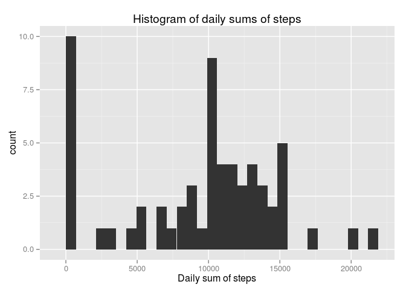

# Reproducible Research: Peer Assessment 1


## Loading and preprocessing the data


```r
activityFile <- "activity.csv"
zippedFile <- "activity.zip"

if(!file.exists(activityFile)) {
    unzip(zippedFile)
    message(paste("" ,zippedFile, "extracted to", activityFile, "file"))
} else {
    message(paste(activityFile, "file already existed."))   
}
```

```
## activity.csv file already existed.
```

```r
activity <- read.csv(activityFile)
```

## What is mean total number of steps taken per day?


```r
library(dplyr)
```

```
## 
## Attaching package: 'dplyr'
## 
## The following objects are masked from 'package:stats':
## 
##     filter, lag
## 
## The following objects are masked from 'package:base':
## 
##     intersect, setdiff, setequal, union
```

```r
activityDaily <- activity %>%
                    group_by(date) %>% 
                    summarise(stepsSum = sum(steps, na.rm = TRUE)) %>% 
                    as.data.frame()

library(ggplot2)
hist1 <- qplot(activityDaily$stepsSum, geom="histogram", xlab = "Daily sum of steps") 
hist1 <- hist1 + ggtitle("Histogram of daily sums of steps")
hist1
```

```
## stat_bin: binwidth defaulted to range/30. Use 'binwidth = x' to adjust this.
```

 

```r
# Calculating daily mean and median number of steps
dailyMean <- mean(activityDaily$stepsSum)
dailyMedian <- median(activityDaily$stepsSum)
# dailyMean
# dailyMedian
```

Daily mean: 9354.23  
Daily median: 10395

## What is the average daily activity pattern?


## Imputing missing values


## Are there differences in activity patterns between weekdays and weekends?
